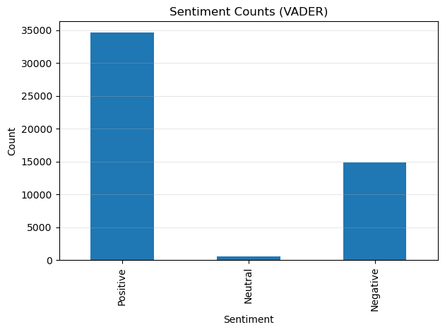
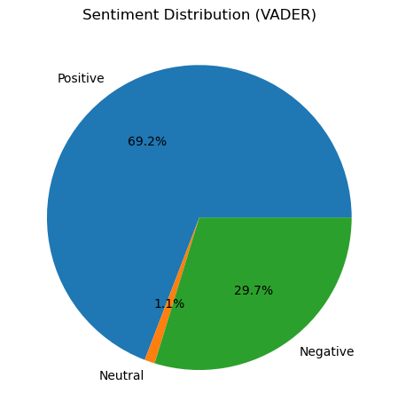

# Growfinix-Task-4-For-Intership
"Portfolio of Data Science internship work at Growfinix, showcasing data preprocessing, EDA, visualization, and insights generation, organized by tasks with code, datasets, and visual outputs."
# 🎬 Movie Review Sentiment Analysis (Task 4)

This project performs sentiment analysis on movie reviews using **VADER** (Valence Aware Dictionary and sEntiment Reasoner) from NLTK and includes an **optional UI with Streamlit** for real-time analysis.

---

## 📌 Task Overview
**Source:** Growfinix Task 4  
**Goal:** Analyze IMDB or custom review dataset, classify sentiments, and visualize results.

### Steps Implemented:
1. Load IMDB or custom CSV of reviews.
2. Clean text: remove stopwords, punctuation, and convert to lowercase.
3. Use VADER for sentiment polarity.
4. Classify reviews as Positive, Negative, or Neutral.
5. Add a new column with sentiment labels.
6. Count total positive, negative, and neutral reviews.
7. Create **Bar Chart** & **Pie Chart**.
8. Show top 3 positive and negative reviews.
9. Save final results to `sentiment_analysis_results.xls`.
10. **Bonus:** Added a Streamlit app (`streamlit.py`) for real-time sentiment analysis using both **VADER** and **HuggingFace Transformers**.

---

## 📊 Results
- **Positive:** ~69% of reviews
- **Negative:** ~30% of reviews
- **Neutral:** ~1% of reviews

### Visualizations:
**Bar Chart**  


**Pie Chart**  


---

## 🛠 Tech Stack / Tools
- **Language:** Python
- **Libraries:** Pandas, Matplotlib, NLTK (VADER), TextBlob, Transformers (HuggingFace), Streamlit
- **IDE:** Jupyter Notebook

---

## 📂 Files in This Repository
| File | Description |
|------|-------------|
| `final_sentiment_analysis Task.ipynb` | Jupyter Notebook with full code |
| `sentiment_bar.png` | Bar chart of sentiment counts |
| `sentiment_pie.png` | Pie chart of sentiment distribution |
| `sentiment_analysis_results.xls` | Final classified reviews with sentiment |
| `Screenshot 2025-08-14 202256.png` | Task description screenshot |
| `streamlit.py` | Streamlit app for live sentiment checking |
| `requirements.txt` | Required Python libraries |
| `README.md` | Project documentation |

---

## 🚀 How to Run Locally

### 1️⃣ Run the Notebook
1. Clone this repository:
   ```bash
   git clone https://github.com/YOUR_USERNAME/movie-review-sentiment-analysis.git
   cd movie-review-sentiment-analysis

